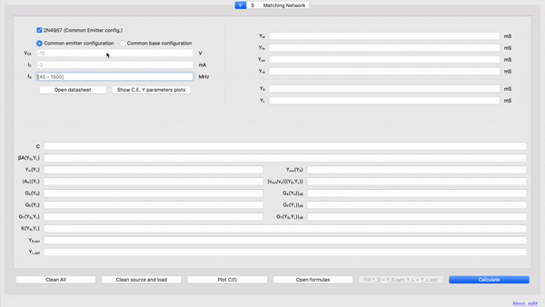

# syRF

<!-- CAD tool to help you design RF and microwave circuits.<br> -->

Check [this webpage](https://urbanij.github.io/syRF/) for an overview.

##### Demo 

[](https://youtu.be/yJPomOStffk)

Watch full video [demo](https://youtu.be/yJPomOStffk) "tutorial".


### How to

#### Prerequisites
If not yet installed on your machine, install:
- [Python3.7](https://www.python.org/)
- [pipenv](https://github.com/pypa/pipenv)
- [git](https://git-scm.com/)  _(optional)_

#### Running <sup>1</sup>

Either clone 
```sh
git clone https://github.com/urbanij/syRF.git
``` 
or download the repository locally
and `cd` into it.
```sh
cd syRF
```
Then activate the virtual environment
```sh
pipenv shell
```
and sync/download the mandatory third-party libraries/packages
```sh
pipenv sync
```
If the process finishes successfully it should print: _All dependencies are now up-to-date!_

Now type 
```sh
make
```
to generate the Python GUI files from the XMLs, and finally
```sh
./syRF_launch
```
to launch the application. (use `syRF_launch.bat` if you're on Windows)


## Contributing

Please read [CONTRIBUTING.md](https://github.com/urbanij/syRF/blob/master/CONTRIBUTING.md) for details on our code of conduct, and the process for submitting pull requests.

## TODO

- Turn this into a stand alone, easy-distributable application.

## Authors

* [Francesco Urbani](https://urbanij.github.io/)

See also the list of [contributors](https://github.com/urbanij/syRF/graphs/contributors) who participated in this project.

## License

This project is licensed under the MIT License - see the [LICENSE](https://github.com/urbanij/syRF/blob/master/LICENSE) file for details

## Acknowledgments

- [WebPlotDigitizer](https://automeris.io/WebPlotDigitizer/) used to extract the data of the printed plots into a handy `.csv` file ready to be plotted and manipulated.
- [PyQt5](https://pypi.python.org/pypi/PyQt5) and [Qt Designer](http://doc.qt.io/qt-5/qtdesigner-manual.html) used to create the GUI.
- [SciPy](https://www.scipy.org/) used to interpolate the data and smooth the functions.
- [NumPy](https://numpy.org/) used for anything math-related
- [Matplotlib](https://matplotlib.org/) used for plotting


---
<sup>1</sup>: It works even on Windows but it can be slightly more cumbersome. You might need to add to the environment variables at least `python` and `pipenv` if you want to avoid writing the whole executable path each time. To do that open the environment variables settings and add to `path`: `C:\Users\<your_username>\AppData\Local\Programs\Python\Python37` and `C:\Users\<your_username>\AppData\Local\Programs\Python\Python37\Scripts`.

`make` too may fail: if that happens just paste each command inside `all` into the terminal, separately.

Get in touch if you have trouble or just use your favorite flavor of Linux.
